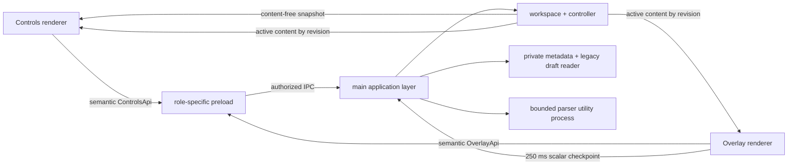

# Teleprompt

Teleprompt reads local files and plays them in a transparent, always-on-top overlay for Linux x64. A separate operator window provides a file playlist, read-only preview, paced scrolling, cue points, appearance settings, and X11 presentation controls. There is no document editor or voice recognition.

Version 1.0 is intentionally released and verified for Linux x64. Windows and macOS are not current release targets.

## Install a release

Download an AppImage, Debian package, or tar archive together with `SHA256SUMS.txt`, then verify the bundle before running it:

```bash
sha256sum --check SHA256SUMS.txt
sudo apt install ./teleprompt_1.1.0_amd64.deb
```

See [INSTALL.md](INSTALL.md) for portable formats, upgrades, local data, platform constraints, and troubleshooting.

## Start developing

Use Node.js 22.12 or newer.

```bash
npm ci
npm run dev
```

The controls window owns file and settings actions. The overlay has a smaller, role-specific API limited to playback, geometry, and window interaction.

## What is supported

- Imports `.txt`, `.md`, `.markdown`, `.fountain`, `.rtf`, `.docx`, `.odt`, `.pdf`, `.html`, `.htm`, `.srt`, and `.vtt` files.
- Reads every source format without writing to it. Edit the source in your preferred application, then choose **Reload source**.
- Restores the playlist and settings after restart, with the selected file loaded first and remaining files restored in the background.
- Preserves existing recovery drafts from earlier releases for read-only access.
- Uses stable document IDs and revisions to keep playback and file selection consistent.
- Runs untrusted document parsing in a bounded, killable Electron utility process.
- Keeps scrolling in the overlay renderer and checkpoints only small scalar progress messages to the main process.
- Supports sanitized Markdown, mirrored text, eye-line/focus modes, countdowns, cue points, manual speed, duration/WPM targets, global hotkeys, and presentation controls. Very large scripts use plain-text rendering. The operator preview is bounded; the overlay plays the full accepted file.

## Playlist and recovery behavior

Playlist changes are committed to private metadata with a backup. Settings are saved automatically; the footer shows the last successful metadata timestamp. On startup, Teleprompt tries the primary state, its backup, and legacy state in order; invalid or future-version state is quarantined rather than shallow-merged.

Source documents are re-read through the same bounded importer. Old recovered scripts restore from their matching draft. Removing or reloading a recovered item preserves its old draft bytes on disk. Playback, clicker arming, and presentation arming always restart off.

## Verification loop

```bash
npm run typecheck
npm run test:real
npm run build
npm run test:e2e
```

`test:real` and the packaged format checks require `TELEPROMPT_REAL_DOCX` and `TELEPROMPT_REAL_PDF` to name genuine documents; attributed public documents are included under `test/fixtures/public`. The reviewed units also require `TELEPROMPT_REAL_CRASH_CORPUS`, a local `crash-corpus` directory captured by the packaged recovery test. Repository Markdown files supply other document bytes. Missing inputs fail the gate. See [capture commands](docs/audits/2026-09-04/CRASH_CORPUS_QUALIFICATION.md) and the [read-only qualification record](docs/audits/2026-09-05/READ_ONLY_RELEASE.md). Full release qualification additionally requires the reviewed-suite manifest and unchanged coverage thresholds.

The packaged tests launch the fused production binary, cross the utility-process importer boundary, verify unchanged source files and settings after restart, exercise playback checkpoints, verify preload isolation and microphone denial, and force renderer crashes to check bounded recreation.

## Architecture



The full design, invariants, and failure policy are in [docs/ARCHITECTURE.md](docs/ARCHITECTURE.md). The completed crash review is in [docs/ARCHITECTURE_REVIEW.md](docs/ARCHITECTURE_REVIEW.md), and the implementation task graph is in [docs/ATG_PLAN.md](docs/ATG_PLAN.md). Release highlights are tracked in [CHANGELOG.md](CHANGELOG.md), with operational sign-off in [docs/RELEASE_CHECKLIST.md](docs/RELEASE_CHECKLIST.md).

## Security and privacy

- Both windows use sandboxing, context isolation, disabled Node integration, navigation denial, a restrictive CSP, and exact role/top-frame IPC authorization.
- Production uses a private `teleprompt://app` renderer origin and hardened Electron fuses; CI verifies the executable and ASAR layout after packaging.
- File reads are regular-file-only, symlink-refusing, bounded, and nonblocking. Archive imports are preflighted for expansion, entry, path, and compression-ratio limits.
- Microphone and other device permission requests are denied. There is no speech recognition engine or voice API.
- Crash reports remain local, secret-like environment variables are removed before Crashpad starts, artifacts are retained for at most seven days/ten files, and the 512 KiB diagnostic log is private, rotated, and credential-redacted.

See [SECURITY.md](SECURITY.md) for the threat model and residual risks.

## Linux notes

- Hardware acceleration is disabled by default because the reviewed installation had historical GPU/renderer native crashes. Set `TELEPROMPT_HWACCEL=1` only after validating the target machine.
- Screen-capture protection is unavailable in Electron on Linux and is disabled in the UI.
- X11 presentation driving requires `xdotool`; Wayland compositors vary in always-on-top and global-hotkey behavior.

Development rules and the TDD loop are in [CONTRIBUTING.md](CONTRIBUTING.md).

## License

MIT — see [LICENSE](LICENSE).
