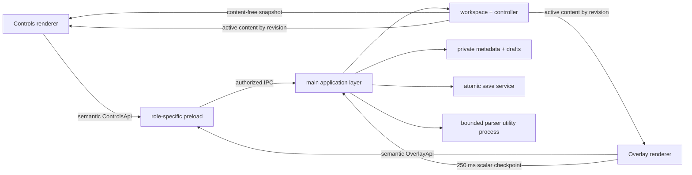

# Teleprompt

Teleprompt is a crash-resilient transparent teleprompter for Linux x64. It provides a separate operator window and always-on-top reading overlay, multi-document workspaces, local recovery drafts, cue points, paced scrolling, optional voice pacing, and X11 presentation controls.

Version 1.0 is intentionally released and verified for Linux x64. Windows and macOS are not current release targets.

## Install a release

Download an AppImage, Debian package, or tar archive together with `SHA256SUMS.txt`, then verify the bundle before running it:

```bash
sha256sum --check SHA256SUMS.txt
sudo apt install ./teleprompt_1.0.0_amd64.deb
```

See [INSTALL.md](INSTALL.md) for portable formats, upgrades, local data, platform constraints, and troubleshooting.

## Start developing

Use Node.js 22.12 or newer.

```bash
npm ci
npm run dev
```

The controls window owns file and settings actions. The overlay has a smaller, role-specific API limited to playback, geometry, and window interaction.

## What is supported

- Imports `.txt`, `.md`, `.markdown`, `.fountain`, `.rtf`, `.docx`, `.odt`, `.pdf`, `.html`, `.htm`, `.srt`, and `.vtt` files.
- Overwrites only lossless text sources: plain text, Markdown, and Fountain.
- Saves extracted PDF, Word, OpenDocument, HTML, RTF, and subtitle content to a new text file; the binary or structured source is never overwritten.
- Detects external edits before overwriting a text source and offers a save-copy path.
- Keeps unsaved edits in private recovery drafts and restores them paused after a clean exit, renderer crash, or process restart.
- Uses stable document IDs and revisions so delayed editor writes cannot modify a neighboring playlist item.
- Runs untrusted document parsing in a bounded, killable Electron utility process.
- Keeps scrolling in the overlay renderer and checkpoints only small scalar progress messages to the main process.
- Supports sanitized Markdown, mirrored text, eye-line/focus modes, countdowns, cue points, manual speed, duration/WPM targets, global hotkeys, and optional voice pacing. Very large scripts stay in plain-text mode and do not enable memory-heavy voice tokenization.

## Save and recovery behavior

An acknowledged editor update is written to a private draft before the command returns. Metadata is then atomically committed with a backup. On startup, Teleprompt tries the primary state, its backup, and legacy state in order; invalid or future-version state is quarantined rather than shallow-merged.

Clean source documents are re-read through the same bounded importer. Dirty documents restore from the matching draft. Playback, voice activity, clicker arming, and presentation arming always restart off.

## Verification loop

```bash
npm run typecheck
npm run test:real
npm run build
npm run test:e2e
```

`test:real` and the packaged format checks require `TELEPROMPT_REAL_DOCX` and `TELEPROMPT_REAL_PDF` to name genuine local documents. Repository Markdown files supply the other document bytes. The reviewed subset refuses missing binary inputs instead of silently skipping them. Legacy suites still containing fabricated fixtures are outside this subset; `npm test`, coverage, and the full release gate remain unqualified until that conversion is complete. See [implementation status](docs/audits/2026-09-04/IMPLEMENTATION_STATUS.md) for evidence and remaining gates.

The packaged tests launch the fused production binary, cross the utility-process importer boundary, protect an externally changed source, recover drafts after restart, exercise playback checkpoints, verify preload isolation, and force a renderer crash to prove bounded recreation.

## Architecture



The full design, invariants, and failure policy are in [docs/ARCHITECTURE.md](docs/ARCHITECTURE.md). The completed crash review is in [docs/ARCHITECTURE_REVIEW.md](docs/ARCHITECTURE_REVIEW.md), and the implementation task graph is in [docs/ATG_PLAN.md](docs/ATG_PLAN.md). Release highlights are tracked in [CHANGELOG.md](CHANGELOG.md), with operational sign-off in [docs/RELEASE_CHECKLIST.md](docs/RELEASE_CHECKLIST.md).

## Security and privacy

- Both windows use sandboxing, context isolation, disabled Node integration, navigation denial, a restrictive CSP, and exact role/top-frame IPC authorization.
- Production uses a private `teleprompt://app` renderer origin and hardened Electron fuses; CI verifies the executable and ASAR layout after packaging.
- File reads are regular-file-only, symlink-refusing, bounded, and nonblocking. Archive imports are preflighted for expansion, entry, path, and compression-ratio limits.
- Voice pacing is off until explicit consent. Chromium speech recognition may use a network service depending on the platform; the UI exposes active status and consent revocation.
- Crash reports remain local, secret-like environment variables are removed before Crashpad starts, artifacts are retained for at most seven days/ten files, and the 512 KiB diagnostic log is private, rotated, and credential-redacted.

See [SECURITY.md](SECURITY.md) for the threat model and residual risks.

## Linux notes

- Hardware acceleration is disabled by default because the reviewed installation had historical GPU/renderer native crashes. Set `TELEPROMPT_HWACCEL=1` only after validating the target machine.
- Screen-capture protection is unavailable in Electron on Linux and is disabled in the UI.
- X11 presentation driving requires `xdotool`; Wayland compositors vary in always-on-top and global-hotkey behavior.
- Voice pacing depends on Web Speech Recognition availability and has no local speech engine fallback.

Development rules and the TDD loop are in [CONTRIBUTING.md](CONTRIBUTING.md).

## License

MIT — see [LICENSE](LICENSE).
