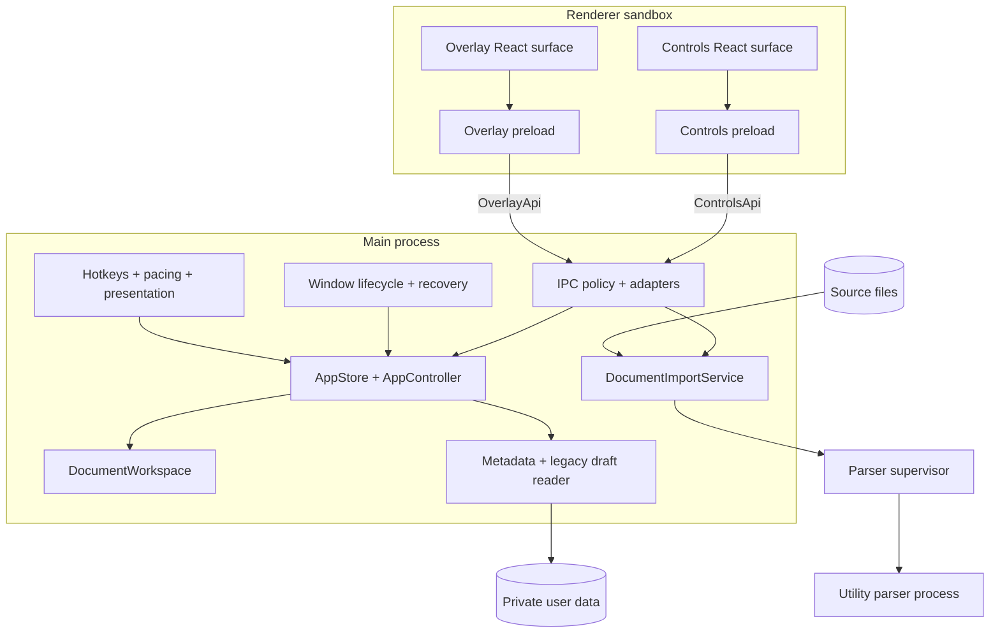
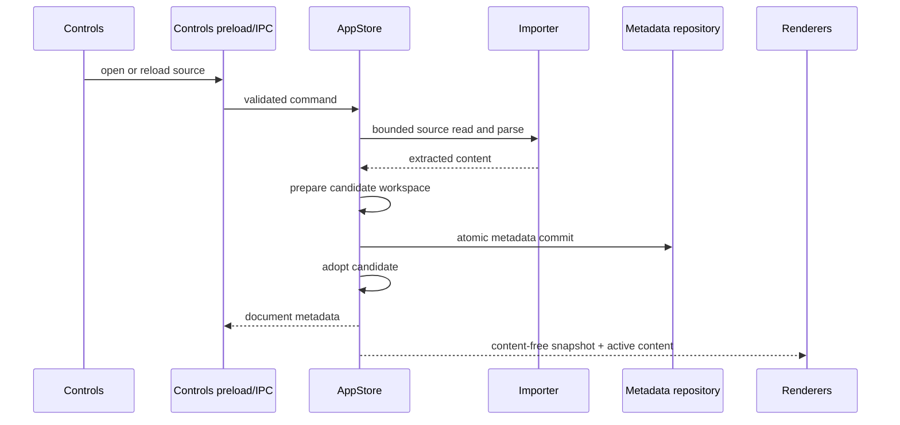

# Teleprompt architecture

## Goals and non-negotiable invariants

Teleprompt reads local files and plays them in a transparent overlay. Version 1.1 removes document editing, source saving, and voice recognition; playback and presentation settings remain available.

1. The Electron main process is the single authority for workspace, files, permissions, windows, integrations, and persistence.
2. A document is addressed by an immutable ID and optimistic revision, never by playlist index.
3. `AppSnapshot` contains metadata and preferences but no script bodies; the overlay receives a still-smaller rendering projection.
4. Only the active document body crosses to a renderer, separately and by revision.
5. Playlist mutations are adopted only after metadata persistence succeeds.
6. Every source format is read-only. Old recovery drafts remain readable and are never deleted by this version.
7. All imports use the same bounded reader, parser supervisor, and utility-process boundary.
8. Playback checkpoints are session-, document-, and revision-scoped scalar messages.
9. Main-process invariant failures terminate after a bounded flush. Renderer failure recovery is bounded and idempotent.
10. Playback and external integrations restore in a safe, paused, unarmed state.

## Runtime topology

## State model and data flow

`DocumentWorkspace` stores private `DocumentRecord` values in a map and maintains a content-free ordered metadata projection. `AppStore` serializes playlist mutations and coordinates metadata persistence. `AppController` owns playback sessions and rejects stale checkpoints.

Settings use a debounced commit. Import, remove, and reload use critical persistence. A transient metadata failure does not poison later persistence attempts. The Controls footer shows the actual mtime of the last successfully loaded or saved metadata file.

## File and parser boundary

`DocumentImportService` canonicalizes a successful source only after a regular-file-only, `O_NOFOLLOW`, nonblocking bounded read. It allows at most two concurrent imports, caps input and extracted output at 10 MiB, and delegates parsing to a utility process with a ten-second timeout and cancellation.

DOCX and ODT archives are inspected before library parsing. ZIP64, encryption, traversal paths, excessive entries, excessive expanded bytes, and excessive compression ratios are rejected. Cancellation and timeout request termination, escalating to SIGKILL after 250 ms. An import holds its concurrency slot until the utility process actually exits. A 50 ms watchdog measures the actual child PID through Electron process metrics and kills it above 512 MiB RSS. This is sampled containment, not a kernel memory ceiling; rapid growth can overshoot the threshold.

The stored document ceiling remains 10 MiB. Markdown falls back to one plain text node above 500,000 visible characters, cue names are capped at 200 characters, and only the first 1,000 cues become UI records. Word statistics scan without creating a full token array. Controls displays at most 32,768 preview characters; the overlay receives the complete accepted document. PDF extraction checks its output budget after each page and always destroys the parser. A single page still requires process containment.

The document save service and content-write IPC no longer exist. Atomic writes remain for application metadata and exported preferences. They use same-directory temporary files, fsync, and rename with target revalidation. Portable rename is not an atomic compare-and-swap with another application.

## Renderer and IPC boundary

The controls and overlay preloads expose distinct semantic APIs. Each main handler validates its payload and is authorized against a manifest containing allowed roles. Authorization also requires the sender's exact static route and top frame. Subframes, unexpected origins, undeclared channels, and cross-role calls are rejected. Controls receive the content-free workspace snapshot; the overlay projection contains only active ID/format/revision and fields required to render playback, never source/recent paths, hotkeys, or microphone consent.

The overlay owns its animation frame loop. It reports progress every 250 ms using document ID, revision, playback session ID, position, and terminal state. This prevents stale renderer work from mutating a new playback session and avoids cloning complete script bodies at frame rate.

Document broadcasts record the last successfully sent ID/revision for each window. Repeated settings saves do not resend that body. The small identity cache clears when a renderer starts loading, becomes unavailable, or is disposed; each surface also receives active content directly through bootstrap. No script bodies are retained by the delivery cache.

## Persistence and recovery

State schema v2 separates:

- strict metadata and persistent preferences in `teleprompt-state.v2.json`;
- one atomic metadata backup;
- existing private recovery drafts from earlier versions, read only;
- transient playback, clicker, presentation, and visibility state, which is not persisted.

Startup reads primary, backup, then legacy state. Invalid JSON, unsupported future schemas, unsafe files, and invalid structures are quarantined. Dirty references require a matching draft. Clean references are re-imported through the normal importer. The selected file loads first; remaining files restore in the background while preserving playlist order, selection, settings, and unresolved references. Missing or unreadable documents become visible startup issues. Removing or reloading a recovered item changes its playlist reference but preserves the old draft bytes on disk.

## Failure policy

`uncaughtException` and `unhandledRejection` are fatal: integrations and IPC are stopped, playback is paused, persistence gets a one-second bounded flush opportunity, and the app exits nonzero. Continuing with a partially corrupted main process is prohibited.

Renderer exits are classified. Crashes, OOM, launch failures, and integrity failures recreate the BrowserWindow after bounded exponential backoff. Lesser abnormal exits may reload. Clean exits during shutdown do nothing. Recovery has a finite budget; an unresponsive renderer is recreated after five seconds. Loaded documents live in the main process, so renderer replacement can restore the reading surface.

Hardware acceleration is disabled by default. Crashpad is local-only; secret-like environment entries are removed before startup and old artifacts are capped by age and count. Linux cleanup pins directory descriptors, opens each descendant with O_NOFOLLOW, and unlinks relative to the held directories. Concurrent directory replacement cannot redirect cleanup through an external symlink. Cleanup is best effort and does not run on unsupported platforms.

## Production package

The initial deployment target is Linux x64. `electron-builder` produces AppImage, deb, tar.gz, and an unpacked verification target. The `afterPack` hook flips a strict Electron fuse set. `verify-artifact.mjs` reads the packaged executable's fuse wire and requires ASAR-only layout. CI uses Node 22.12, a locked install, audit, type checks, coverage thresholds, production packaging, real-binary Playwright recovery tests, and release checksums.

Unsigned artifacts and lack of an auto-updater are deliberate residual release constraints, not hidden capabilities.

## September 2026 implementation qualification

The Controls loading surface opens before workspace hydration. Application IPC waits for the selected file's restoration, and bounds events cannot overwrite persisted state during that interval. Remaining files load sequentially in the background; close waits for that restoration and pending persistence.

Renderer recovery owns a three-attempt/60-second budget per surface across window replacements. A fourth failure stops automatic recovery and offers an explicit native Retry. Normal close cancels pending imports, drains admitted commands and metadata, then destroys Controls or quits. Failed flushing keeps the application open unless the operator explicitly chooses to abandon pending settings changes.

The v2 metadata format remains readable. This release adds no new draft writes or cleanup. Old draft bytes represent the latest available recovery content from the earlier editor, not an exact historical snapshot. Unresolved references remain stored until retry succeeds or the operator removes them. Both packaged preloads and renderers consume the reduced read-only IPC contract together. Existing v2 files can still contain removed editor/voice keys; the state parser ignores them.

On Linux, artifact verification confirms fuse settings and ASAR layout; it does not establish runtime ASAR integrity enforcement. [Electron documents integrity support for macOS and Windows](https://www.electronjs.org/docs/latest/tutorial/asar-integrity). See the dated audit implementation status for executed checks and remaining qualification gates.
