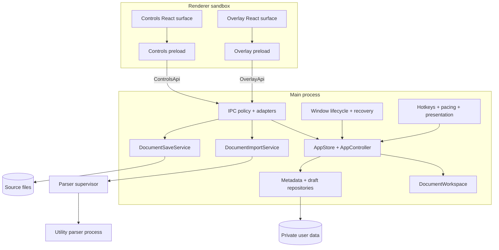
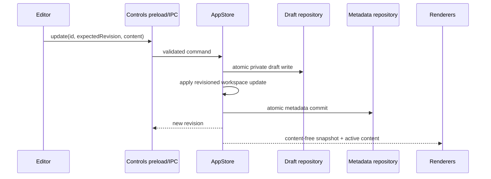

# Teleprompt architecture

## Goals and non-negotiable invariants

Teleprompt is designed to remain usable during a live presentation, preserve acknowledged edits, and avoid modifying a source it cannot reproduce losslessly.

1. The Electron main process is the single authority for workspace, files, permissions, windows, integrations, and persistence.
2. A document is addressed by an immutable ID and optimistic revision, never by playlist index.
3. `AppSnapshot` contains metadata and preferences but no script bodies; the overlay receives a still-smaller rendering projection.
4. Only the active document body crosses to a renderer, separately and by revision.
5. An edit is drafted before it is acknowledged; its metadata reference is durably committed before return.
6. Binary or structured imports are read-only. Extracted text is saved to a new lossless target.
7. All imports use the same bounded reader, parser supervisor, and utility-process boundary.
8. Playback checkpoints are session-, document-, and revision-scoped scalar messages.
9. Main-process invariant failures terminate after a bounded flush. Renderer failure recovery is bounded and idempotent.
10. Playback and external integrations restore in a safe, paused, unarmed state.

## Runtime topology

## State model and data flow

`DocumentWorkspace` stores private `DocumentRecord` values in a map and maintains a content-free ordered metadata projection. `AppStore` serializes mutating document commands and coordinates drafts and metadata. `AppController` owns playback sessions and rejects stale checkpoints.

Settings can use a debounced commit because losing the last slider movement is tolerable. Document create, import, edit, remove, reload, and save use critical persistence because losing an acknowledged script mutation is not. Rejected edits are preflighted before their draft file is touched, and a transient metadata failure does not poison later persistence attempts.

## File and parser boundary

`DocumentImportService` canonicalizes a successful source only after a regular-file-only, `O_NOFOLLOW`, nonblocking bounded read. It allows at most two concurrent imports, caps input and extracted output at 10 MiB, and delegates parsing to a utility process with a ten-second timeout and cancellation.

DOCX and ODT archives are inspected before library parsing. ZIP64, encryption, traversal paths, excessive entries, excessive expanded bytes, and excessive compression ratios are rejected. A malformed or stuck parser is killed without blocking window lifecycle or state persistence; cleanup also tolerates a worker that already exited.

The stored document ceiling remains 10 MiB, but memory-expanding interactive features have tighter limits: Markdown falls back to one plain text node above 500,000 visible characters, voice pacing refuses those documents, cue names are capped at 200 characters, and only the first 1,000 cues become UI records. Word statistics scan without creating a full token array.

The save service allows in-place writes only for text, Markdown, and Fountain. It verifies the source hash and modification time, refuses symlinks and non-regular targets, writes a same-directory temporary file, fsyncs it, atomically renames it, and best-effort fsyncs the directory. A conflict leaves both the external source and local recovery draft intact.

## Renderer and IPC boundary

The controls and overlay preloads expose distinct semantic APIs. Each main handler validates its payload and is authorized against a manifest containing allowed roles. Authorization also requires the sender's exact static route and top frame. Subframes, unexpected origins, undeclared channels, and cross-role calls are rejected. Controls receive the content-free workspace snapshot; the overlay projection contains only active ID/format/revision and fields required to render playback, never source/recent paths, hotkeys, or microphone consent.

The overlay owns its animation frame loop. It reports progress every 250 ms using document ID, revision, playback session ID, position, and terminal state. This prevents stale renderer work from mutating a new playback session and avoids cloning complete script bodies at frame rate.

## Persistence and recovery

State schema v2 separates:

- strict metadata and persistent preferences in `teleprompt-state.v2.json`;
- one atomic metadata backup;
- one private draft file per dirty document;
- transient playback, editor, voice, clicker, presentation, and visibility state, which is not persisted.

Startup reads primary, backup, then legacy state. Invalid JSON, unsupported future schemas, unsafe files, and invalid structures are quarantined. Dirty references require a matching draft. Clean references are re-imported through the normal importer. Missing or unreadable documents become visible startup issues rather than an application crash.

## Failure policy

`uncaughtException` and `unhandledRejection` are fatal: integrations and IPC are stopped, playback is paused, persistence gets a one-second bounded flush opportunity, and the app exits nonzero. Continuing with a partially corrupted main process is prohibited.

Renderer exits are classified. Crashes, OOM, launch failures, and integrity failures recreate the BrowserWindow after bounded exponential backoff. Lesser abnormal exits may reload. Clean exits during shutdown do nothing. Recovery has a finite budget; an unresponsive renderer is recreated after five seconds. Drafts live in the main process and on disk, so renderer replacement does not lose acknowledged edits.

Hardware acceleration is disabled by default. Crashpad is local-only; secret-like environment entries are removed before startup and old artifacts are capped by age and count.

## Production package

The initial deployment target is Linux x64. `electron-builder` produces AppImage, deb, tar.gz, and an unpacked verification target. The `afterPack` hook flips a strict Electron fuse set. `verify-artifact.mjs` reads the packaged executable's fuse wire and requires ASAR-only layout. CI uses Node 22.12, a locked install, audit, type checks, coverage thresholds, production packaging, real-binary Playwright recovery tests, and release checksums.

Unsigned artifacts and lack of an auto-updater are deliberate residual release constraints, not hidden capabilities.
