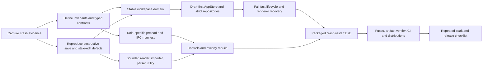

# Architecture task graph and TDD loop

This is the completed autonomous task graph used for the 1.0 rebase. Dependencies run left to right; tasks in the same column can be reviewed independently.



## Completed workstreams

| Workstream | Exit condition | Status |
| --- | --- | --- |
| Crash evidence | identify the observed loop and distinguish evidence from inference | complete |
| Domain model | stable IDs, revisions, bounded workspace, content-free snapshot | complete |
| Durability | private drafts, critical commits, backup fallback, quarantine, safe restart | complete |
| Files and parsing | one bounded path, utility-process timeout/cancel, archive policy, safe save | complete |
| Lifecycle | fail-fast main process, bounded renderer recreation, local bounded diagnostics | complete |
| IPC and security | typed semantic roles, exact sender policy, permission policy, hardened protocol/fuses | complete |
| Product surfaces | revisioned editor, local overlay RAF, accessible status/conflict/privacy flows | complete |
| Deployment | Linux x64 AppImage/deb/tar.gz, checksums, CI, release documentation | complete |
| Verification | unit/coverage, real packaged E2E, repeated crash/restart soak | complete |

## Continuing iteration loop

Every new defect enters the same loop:

```text
evidence → smallest failing regression → invariant-level fix
        → focused green → full coverage gate
        → packaged boundary test when applicable → soak → release
```

A fix is not complete when only the original symptom disappears. It is complete when the underlying invariant is stated, enforced at the owning boundary, and protected at both the lowest useful test layer and any affected production process boundary.

The commands implementing this loop are:

```bash
npm run test:watch
npm run check
npm run check:release
npm run test:soak
npm run package
```
