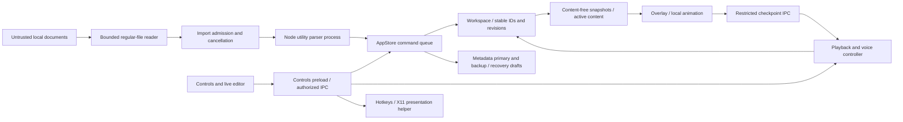

# Teleprompt architectural audit — 2026-09-04

Historical audit-stage record. For subsequent implementation and installation results, see [IMPLEMENTATION_STATUS.md](IMPLEMENTATION_STATUS.md) and [RELEASE_1.0.1.md](RELEASE_1.0.1.md).
Recommendation: retain the current Electron/main/preload/renderer architecture and repair its lifecycle, durability, and asynchronous contracts before optimizing it. The existing boundaries are useful; their integration does not yet support the reliability claims in the July audit. Six defects were reproduced using the actual package or production storage classes and real repository documents. This audit does not establish release readiness.

Implementation order, acceptance gates, compatibility, and rollback are in [IMPLEMENTATION_PLAN.md](IMPLEMENTATION_PLAN.md).

## Scope and evidence

Reviewed commit: `984b52b5acf2c5042a0dbe70b359d6f38dc6c981`. The initial dirty paths were `.gitignore`, `.claude/`, `.ignore`, and `.mcp.json`; they were left unchanged. Application source and dependency manifests were not edited. Fresh generated build output and an isolated temporary package were produced. This audit directory is new and uncommitted.

Coverage includes startup/shutdown and renderer recovery; workspace, editor and playback consistency; source imports/saves, parser isolation, archives and persistence; IPC, permissions, CSP, preload and package hardening; voice, geometry, gestures and allocation costs; diagnostics, test strategy and release qualification. Independent security, storage, and renderer reviews were reconciled against source and focused runtime observations.

Evidence labels used below:

- **Reproduced:** an observed failure using the actual implementation and real content, recorded in the evidence directory.
- **Source-confirmed:** the implementation defect or missing safeguard is directly visible; the stated runtime consequence is an inference unless separately reproduced.
- **Measurement needed:** a resource or performance risk requiring an actual workload measurement.

Knowledge OS context for `proj_teleprompt` passed its reference check: 72 IDs, none missing. `accepted_facts` and `known_conflicts` were empty. Historical extracted objects `dec_c2546cf00175`, `clm_b4560ec0b4d2`, `clm_12f847f9dfe1`, and `clm_7dcc8363809f` concern prior crashes/feedback loops; they are leads, not proof about this commit. `clm_bf418fe39755` says no tests/CI existed; that is stale, contradicted by 25 current unit-test files and `.github/workflows/ci.yml`. Unrelated project results in the context package were excluded.

## Baseline and actual verification

| Check | Result |
| --- | --- |
| `npm ls --depth=0` | Installed direct dependencies resolved successfully |
| `npm run typecheck` | Exit 0 |
| `npm run build` | Exit 0; fresh main, worker, preload and renderer artifacts |
| `electron-builder --linux --dir --config.directories.output=/tmp/teleprompt-audit-2026-09-04/release` | Exit 0 |
| Artifact verifier against that package | Exit 0 |
| `npm audit --json` | Exit 1: 14 high, 2 moderate affected packages; no critical |
| `npm audit --omit=dev --json` | Exit 1: 2 moderate affected packages; no high/critical |
| Focused real-content checks | 8 expectations: 2 passed, 6 failed, detailed below |
| Existing Vitest/Playwright suites | Not run: authored/generated content and mocks conflict with the user’s fixture policy |
| CPU, peak RSS, heap retention, real microphone, Wayland, installed deb/AppImage | Not qualified in this audit |

Node was `v26.7.0`, npm `11.19.0`; CI pins Node `22.12.0`. Therefore this is not a reproduction of the CI environment. Existing `out/` and packaged executable mtimes were July 19, earlier than the checked source timestamp; those artifacts were not trusted as the runtime baseline. Fresh artifact identity, source hashes, source mtimes and tool versions are recorded in [baseline.json](evidence/baseline.json).

The package ran under Xvfb with a disposable `XDG_CONFIG_HOME`, using the existing root-owned mode-4755 Chromium helper through `CHROME_DEVEL_SANDBOX`. No sandbox bypass flag or native permission change was used. CDP was enabled only on that audit process. The real README imported byte-for-byte and overlay metadata omitted source paths. Screenshots of the actual [Controls](evidence/controls.png) and [Overlay](evidence/overlay.png) surfaces were captured; Controls was visually inspected.

Storage probes used the actual AppStore, repositories, importer, parser and save service compiled from this checkout. Their source and edit content were byte copies of `README.md` and `SECURITY.md`. Only temporary copies were changed. Failure injection used real file renames and directory permissions, with no fake repository implementation. The collectors report observations; inspect their JSON rather than interpreting collector exit 0 as a passing gate.

An initial exploratory click established that “New blank script” creates seeded text (`Controls.tsx:535`). That changed the active document, invalidating the first probe’s subsequent document-identity comparison. That content-loss inference was discarded. The retained packaged results come from a fresh profile using only the real README; it remained intact after all four renderer crashes.

## Architecture and trust boundaries

Confirmed strengths: sandboxed, isolated renderers with Node disabled; separate controls and overlay APIs; exact route/top-frame/role IPC checks; bounded regular-file reads with `O_NOFOLLOW`; stable document IDs and revision preflight; draft-first edits and serialized document commands; utility-process parsing with timeout and concurrency two; local animation with throttled checkpoints; sanitized Markdown; explicit voice consent; fixed presentation executable paths and argument arrays; local diagnostic rotation; package fuse verification.

The main process owns privileged file/window/integration operations. Parser utility isolation is a crash boundary, not a claim of an OS sandbox against arbitrary parser code execution. The controls renderer holds document editing and source-path authority; the overlay receives substantially less authority and metadata. Both source documents and recovery drafts are sensitive assets. There is no server, tenant system, or authentication database requiring a new service layer.

## Findings, ordered for action

| ID / priority | Finding, evidence and consequence | Required change |
| --- | --- | --- |
| F01 / P1 | **Reproduced: recovery budget resets on window replacement.** `src/main/windows.ts:143` constructs a new policy per BrowserWindow; `:167–168` recreates the window; `:305–325` installs a fresh policy. The fourth forced Controls crash recovered within 6.67 seconds total, although the policy is three attempts per 60 seconds. Every document-integrity check passed. Unresponsive recreation at `:176–184` bypasses the budget too. | Own recovery history per surface outside the replaceable window; put unresponsive recovery through the same budget. Reset only after an explicitly healthy interval or deliberate retry. |
| F02 / P1 | **Reproduced: empty document edits are rejected.** `src/main/ipc.ts:149,558–560` applies a nonempty-string validator to content. The package returned `invalid content` for an empty update. Create has the same validator at `:114`; the blank button masks it with seeded prose at `Controls.tsx:535`. **Source-confirmed:** workspace/IPC limits count UTF-16 units while drafts count UTF-8 bytes (`workspace.ts:161–165`, `repositories.ts:124`). | Permit genuinely empty content; keep paths/names nonempty. Apply one byte-based document limit before mutation and expose typed size errors. Remove seeded blank content and shipped demonstration scripts under the user’s policy. |
| F03 / P1 | **Reproduced: successful save can invalidate the backup.** Metadata rotation preserves the old dirty reference (`repositories.ts:87–96`), then save/reload deletes its only draft (`app-store.ts:238–239,258–259`). In the real-file probe, save succeeded; `.bak` still said dirty; the draft was absent; backup recovery restored zero documents. | Retain content required by both primary and backup, and make recovery validate reference/content consistency before cleanup. |
| F04 / P1 | **Reproduced: temporary source unavailability becomes permanent loss of automatic recovery.** Initialization skips failed references, then persists the incomplete workspace (`app-store.ts:48–73,85–87`). A later flush rotates away the surviving reference. Returning the actual file restored zero documents, although source bytes still existed. | Preserve unresolved references; expose retry/remove state. A transient read/parser failure must not become an implicit workspace deletion. |
| F05 / P1 | **Source-confirmed shutdown gap; data loss inferred.** The editor holds text for 200 ms (`EditorPane.tsx:85–92`). Native Controls close has no flush handshake (`windows.ts:98–120`). Quit unregisters IPC before storage flush (`index.ts:219–223`), and `AppStore.flush()` never drains `commandQueue` (`app-store.ts:290–297,348–354`). | Stop admission, flush the live editor while IPC is available, drain admitted document operations, flush storage, then close. Normal quit must surface failure rather than silently treating a timeout as durable success. |
| F06 / P1 | **Reproduced: metadata rejection leaves a new in-memory revision behind.** Update writes the draft and advances workspace state before metadata persistence (`app-store.ts:166–169`); IPC only publishes on success (`ipc.ts:146–152`). A real EACCES caused rejection while revision advanced 0→1; retry at revision 0 conflicted. Other mutating commands have analogous partial-outcome windows. | Define and implement explicit durable, rejected, and partially completed outcomes. Keep renderer revision and storage-health state coherent; retain recovery content when source save succeeded but metadata failed. |
| F07 / P1 | **Source-confirmed editor conflict bypass and unbounded submission queue.** Incoming content always advances `revisionRef`, even with dirty local text (`EditorPane.tsx:29–45`). Reload retains the same editor key (`Controls.tsx:241–253,418`). Pending old content may overwrite a newly reloaded revision. Every submission retains another full string in the Promise chain (`EditorPane.tsx:38–64`); memory/latency growth under slow disk is unmeasured. | Separate local draft base revision from latest received revision; cancel old generations on deliberate reload; halt on conflict. Use one active write plus one replaceable latest pending value. |
| F08 / P1 | **Reproduced: a pre-seek checkpoint can undo a seek.** `controller.ts:53–58` retains session identity for nonterminal seeks; `:66–91` accepts the older checkpoint. Replaying an actually observed position after seeking to zero returned `ok: true` and restored `0.0015714068441064636`. A delayed terminal checkpoint can likewise stop later playback; that variant was not exercised. | Introduce a discontinuity generation or rotate session identity on seek. Bind both overlay modes to it; distinguish progress acknowledgments from authoritative seeks. |
| F09 / P1 | **Source-confirmed ZIP validator/extractor disagreement.** `zip-policy.ts:19,31` iterates only the EOCD-declared count and never checks consumed directory size/count. JSZip `zipEntries.js:129–150` scans actual signatures and tolerates count mismatch. ODT extraction can consume entries the policy did not inspect. A malformed archive exploit was not executed. | Validate complete directory extent/count/EOCD consistency and every consumed entry. Bound actual decompression, not only declared sizes. |
| F10 / P1 hardening | **Source-confirmed missing resource budgets; exhaustion is an inference.** Extraction allocates whole output before checking limits (`parser-core.ts:24–60`); child configuration has no memory ceiling (`electron-adapter.ts:5–9`). The two-import semaphore limits active work but its waiter list has no bound (`import-service.ts:72–99`), and IPC callers do not pass cancellation. Editor/storage queues and issue strings add further retention paths. | Add bounded pending admission, owner/shutdown cancellation and actual output ceilings. Establish parser RSS/heap measurements before choosing a watchdog budget; V8 heap limits alone do not cover native/Buffer allocations. |
| F11 / P1 release | **Confirmed by current registry audit:** 14 high and 2 moderate affected packages. `app-builder-lib` 26.8.1 is in the affected range for AppImage search-path injection. A build-time dependency can affect the distributed launcher. Production-only results are DOMPurify and xmldom, both moderate in npm’s output. | Refresh and review the lockfile, update the builder beyond the advisory’s fixed floor, rebuild all distribution formats and rerun real-content checks. Do not equate affected-package counts with proven reachable exploits. |
| F12 / P2 security | **Source-confirmed packaged trust in a development URL.** `windows.ts:13,50–53,217–225` uses inherited `ELECTRON_RENDERER_URL` even when packaged, and IPC authorization follows that URL. This was also present in the fresh compiled bundle. Launcher/environment control is required; ordinary document-only exploitation is not established. | Packaged routes must always be the bundled custom protocol. Restrict development URLs to an explicit development configuration. |
| F13 / P2 | **Source-confirmed external-save race; collision not reproduced.** Hash validation (`save-service.ts:47–50`) and mtime validation (`atomic-write.ts:20–34`) occur before temporary write/fsync and blind rename (`:44–52`). Another writer in that interval can lose its newer content. | Revalidate identity/hash near replacement, serialize same-target writes and preserve a recoverable prior version. A final stat is not cross-process compare-and-swap; document the residual limit. |
| F14 / P2 | **Source-confirmed geometry lifecycle defect.** FullView’s observer installs once and returns forever if no text exists at mount (`Overlay.tsx:299–314`); DOM replacement can detach its targets. Banner uses horizontal motion without equivalent target-geometry reporting. Stale geometry can miscompute pacing; runtime resizing was not qualified. | Attach observers to actual element lifetime; version/report geometry per document and layout. Use horizontal range for banner, and cached geometry for animation. |
| F15 / P2 | **Source-confirmed voice lifecycle contradictions.** Stopped recognizers retain result/error callbacks (`voice.ts:130–155,193–208`), while every document revision replaces recognition (`Controls.tsx:90–129`). Transient errors become terminal controller state, defeating retry; thrown restart errors are swallowed (`voice.ts:167–174`). Speech callbacks tokenize full content two or three times (`Controls.tsx:98–115`). | Guard callbacks with recognition generation, detach before abort, distinguish restarting from terminal error, and cache stripped text/tokens per revision. Real microphone validation is required. |
| F16 / P2 | **Source-confirmed startup and observability gaps.** All restoration finishes before windows are created (`index.ts:108,139–140`), with sequential per-document timeouts. Background persistence issues append indefinitely and reach UI through bootstrap only (`app-store.ts:313–317,342–344`; `ipc.ts:69–72`). | Show bounded recovery progress, prioritize active content, preserve unresolved references, and publish a capped/deduplicated storage-health state. Measure actual startup and idle resource costs. |
| F17 / P1 verification | **Confirmed assurance mismatch.** Existing tests author/generated documents and use mocks; no provenance-backed binary/hostile corpus was established. Coverage excludes application store/controller, IPC, parser, repositories and renderers (`vitest.config.ts:12–14`), despite their critical roles. Soak repeats two E2E tests three times; it is not a memory stress test. July docs describe bounded recovery and backup durability more strongly than current results support. | Replace fabricated fixtures with traceable real inputs, cover actual integration paths, add workload/retention measurements and update release claims to match evidence. |
| F18 / P2 | **Source-confirmed asynchronous UI and gesture cleanup gaps.** Several event handlers discard rejecting promises; ErrorBoundary does not catch those. One confirmation resolver can be replaced (`Controls.tsx:161–162`), and the dialog lacks focus containment (`ui.tsx:135–166`). Drag/resize cleans up on mouseup only (`Overlay.tsx:14–54`). | Catch/report action failures, prevent conflicting duplicate actions, serialize confirmations with focus restore, and dispose gestures on cancel/blur/unmount using pointer capture. |

Dependency details: the [builder advisory](https://github.com/electron-userland/electron-builder/security/advisories/GHSA-7g7r-gx96-252g) identifies `<26.15.0` as affected and explains how empty launcher search-path components can load a library from the current directory. Actual AppImage exploitation was not tested. The [DOMPurify advisory](https://github.com/cure53/DOMPurify/security/advisories/GHSA-55q2-fjhq-7xh7) requires in-place sanitization plus a removal hook; the reviewed renderer uses string sanitization without that combination, so this audit does not assert reachable XSS from that advisory. The maintainer labels it low while npm reports moderate; the baseline preserves npm’s classification. npm recommends 3.4.14; the advisory’s fixed floor is 3.4.13.

## Claims rejected or explicitly limited

- Do not report the old render/IPC feedback loop as the present crash cause. Current evidence establishes a different recovery-budget integration defect.
- Do not report arbitrary file reads from ordinary renderer JavaScript merely because `documents:openDropped` accepts a path internally. The exposed preload takes a real File and uses Electron’s `webUtils.getPathForFile`.
- Do not call renderer process isolation a hard parser memory budget or OS sandbox.
- Do not call a successful fuse-wire check Linux ASAR tamper enforcement. Electron documents the embedded integrity feature for macOS/Windows; the verifier tests configuration bits and layout, not Linux tamper resistance. See [Electron fuses](https://www.electronjs.org/docs/latest/tutorial/fuses).
- Do not call observed send failures after `Page.crash` a fatal-main crash. The log records attempts to send to disposed frames, but the main process survived all four tests. Skip broadcasts to known dead frames as part of F01.
- No memory leak, CPU regression, optimization gain, actual malicious-file compromise, native SIGILL/SIGSEGV cause, microphone behavior or Wayland behavior was established here.
- There is no unit/E2E passing baseline and no “no regressions” claim. The focused baseline is explicitly 2 passing / 6 failing expectations before any application fix.

## Evidence index

- [Runtime observations](evidence/runtime-results.json), [runtime log](evidence/runtime.log), [runtime collector](evidence/runtime-check.mjs).
- [Storage observations](evidence/storage-results.json), [storage collector source](evidence/storage-check.ts).
- [All-dependency audit](evidence/npm-audit.json), [production dependency audit](evidence/npm-audit-production.json).
- [Identity/provenance baseline](evidence/baseline.json); screenshots linked above.

The full package and disposable failure-injection profiles remain under `/tmp/teleprompt-audit-2026-09-04`; they are not release artifacts. Binary-format stress, hostile archive validation and microphone tests need actual inputs/devices. Do not replace that missing evidence with generated documents or fabricated speech.
