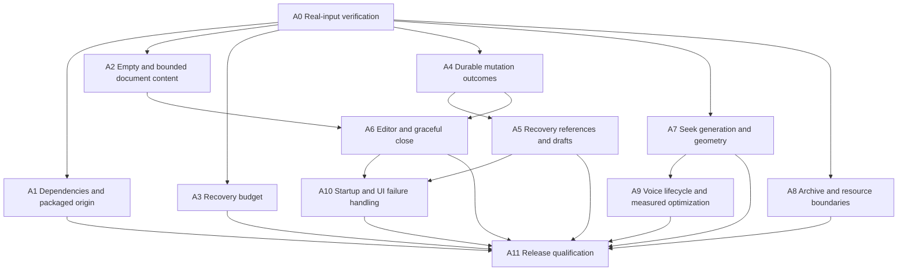

# Teleprompt implementation plan — 2026-09-04

Historical audit-stage record. For subsequent implementation and installation results, see [IMPLEMENTATION_STATUS.md](IMPLEMENTATION_STATUS.md) and [RELEASE_1.0.1.md](RELEASE_1.0.1.md).
This is an executable remediation sequence for commit `984b52b5acf2c5042a0dbe70b359d6f38dc6c981`, based on [AUDIT.md](AUDIT.md). No application fixes, dependency updates, commits, pushes or deployments were performed during the audit.

Recommendation: start with A0, then the independent security, content-validation and recovery slices A1–A3. Repair transaction semantics before dependent recovery/editor/shutdown work. Retain the existing main/store/domain/parser/preload split. A framework rewrite, database replacement, local speech-model migration, or global state-management library is unnecessary for the confirmed failures.

## Dependency graph



Each slice requires a focused real-input reproduction, the narrowest owning-boundary fix, re-execution of the focused checks and the full compliant gate, and a written baseline delta. Preserve the existing unrelated dirty paths. Stage only task-owned files if a commit is later requested. A passing gate is not permission to publish.

## Implementation slices

| Slice | Exact scope and implementation | Acceptance / exit condition |
| --- | --- | --- |
| **A0 — establish compliant verification**; F17 | Start from hashes in `evidence/baseline.json`. Adapt the retained collectors into normal failing tests using the actual implementation and repository Markdown files. Replace generated fixtures/mocks in the existing tests with provenance-backed content and real temporary filesystem/process operations. Add a corpus manifest containing origin, hash, byte length and transformations. Inspect every one of the 25 unit-test files and `e2e/app.spec.ts`; do not silently skip or delete assertions to make the gate pass. Expand coverage ownership to application, persistence, parser, IPC integration and renderer lifecycle. | Record fresh test counts and failing names. Reproduce the current six failures without fake repositories or authored sample text. Markdown checks can begin immediately. DOCX/ODT/PDF, malformed archive, large multilingual script and microphone acceptance remain evidence-blocked until actual inputs are available. |
| **A1 — dependency and package security**; F11–F12, part F17 | Update `package.json`/lockfile deliberately: builder fixed floor 26.15.0, DOMPurify patched release, and compatible transitive fixes identified by current audit. Inspect dependency changes; avoid blind major upgrades. In `windows.ts`, require `!app.isPackaged` for development URL use and otherwise use only bundled routes. Keep restricted role APIs, CSP and fuse verification. Correct Linux integrity claims in `SECURITY.md`, architecture docs and verifier messaging. | Audit has zero high/critical packages; each remaining lower advisory has written reachability and disposition. Fresh unpacked app ignores inherited development URL. Inspect rebuilt AppImage launcher search paths and run it in a controlled directory. Artifact verifier and real-content smoke tests pass. No global install is needed. |
| **A2 — valid document content**; F02, part F17 | Split content validation from nonempty names/paths in `ipc.ts`; accept `''`. Centralize persistence byte limits across workspace/import/editor contracts and return `too-large` before mutation. Make New blank script create empty content. Remove shipped fabricated examples and their menu/imports from `Controls.tsx` and `shared/examples.ts`, as required by user policy. | Empty create and clearing a real document work through packaged IPC, persist zero-byte content and reopen correctly. Names/paths still reject empty input. Oversized actual multilingual content returns typed size failure without replacing the previous recovery draft. Real input within the byte limit succeeds. |
| **A3 — bounded renderer recovery**; F01 | Move `RendererRecoveryPolicy` ownership into a role-level lifecycle owner that survives BrowserWindow recreation. Route crashed/OOM/launch-failed/unresponsive events through it. Keep one recovery timer per role, cancel on shutdown, and gate broadcasts on a live ready frame. Retain the three-attempt/60-second policy unless real evidence supports changing it. | Three controlled crashes within the window consume the budget; a fourth does not automatically recreate. Repeat for overlay, controls and unresponsive recovery. Explicit retry and healthy reset have documented behavior; clean exit/quit never relaunch. Acknowledged real draft content survives. |
| **A4 — coherent durable mutation outcomes**; F06 | Audit create/import/update/remove/reload/save individually in `app-store.ts`. Keep rejected workspace-only mutations on the prior published revision until persistence succeeds; stage candidate state/content so failure does not replace the last recoverable content. If a source write has already completed, return a typed partial outcome with current revision, storage failure and a retained draft. Add bounded storage-health publication through contracts/preload/IPC. Do not hide failures in generic rejected promises. | The real EACCES probe no longer returns an ordinary rejection with an unpublished advanced revision. Retry cannot silently overwrite or require guessing the current revision. Inject actual backup/metadata failures around each operation using disposable directories; visible state, primary/backup and drafts agree with the outcome returned to Controls. |
| **A5 — recoverable metadata and draft retention**; F03–F04 | Preserve unresolved source/draft references across initialization and subsequent saves; offer Retry or explicit Remove. Retain a draft while either primary or backup requires it. Before cleanup, read/validate both reference sets; errors defer cleanup. Define v2 backup semantics as recovery of available latest content, not exact historical rollback. Keep unresolved entries separate from loaded content while retaining the original reference in persistence. | Both storage recovery probes pass. Edit→save/reload→primary unavailable restores a usable document; a temporarily unavailable real source reappears after availability returns, even after intervening settings saves. User removal is the only path that intentionally removes an unresolved reference. No unbounded orphan accumulation: measure referenced vs unreferenced bytes and implement conservative cleanup only after successful commits. |
| **A6 — editor conflict, queue and close protocol**; F05–F07 | `EditorPane.tsx` gets a stable draft base revision, explicit reset generation, one in-flight update and one latest pending value. Stop on conflict and preserve both alternatives for deliberate resolution. A confirmed reload cancels old pending generations. Add typed main↔controls flush request/acknowledgment, native-close interception and application closing state. Keep necessary IPC live, await latest editor acknowledgment, drain admitted AppStore commands, flush metadata, then dispose integrations/windows. Fatal shutdown remains bounded and best-effort. | Edit the actual README and immediately close/quit/reopen: latest accepted UI text restores. Quit during actual draft/source writes and verify completion or explicit cancellation/failure. Reload while writes are active never resurrects discarded content. Slow real storage never retains more than one pending full version. Missing/unresponsive renderer produces truthful normal-quit options without an infinite wait. |
| **A7 — authoritative playback and geometry**; F08, F14 | Add a seek/discontinuity generation in controller/contracts/preload/overlay, or rotate playback session while preserving documented countdown behavior. Progress acknowledgments cannot change a newer generation. Remove the 0.0015 heuristic for authoritative seeks. Attach ResizeObservers through current element lifecycle; invalidate geometry on document/layout changes. Report vertical range for full view and horizontal range for banner. | The captured pre-seek checkpoint is rejected and zero remains the authoritative position. Test terminal delayed checkpoints, tiny scrubber steps, cue jumps and both views. Launch empty, import a real document, resize while paused, remove/reopen and switch modes: geometry and pacing remain correct. Changing target mode does not use geometry from the previous document. |
| **A8 — archive and resource containment**; F09–F10 | Make ZIP policy validate the exact directory consumed by the extractor, including count, extent, EOCD bounds, local/central metadata and ZIP64/multidisk policy. Enforce actual streamed expanded-byte and output limits before accumulation. Add bounded pending import admission with deduplication where appropriate and per-owner/shutdown cancellation. Measure real utility-process memory, then add a configurable internal watchdog based on a documented corpus envelope; distinguish process RSS from V8 heap. | Actual valid office documents still parse. A provenance-backed malformed archive is refused before excess expansion; no synthetic hostile archive is substituted. Real large documents stay within recorded limits or produce a visible bounded failure. Closing/quit cancels queued imports and terminates workers. If needed real hostile/large files are unavailable, record this acceptance gate as blocked; do not declare parser hardening complete. |
| **A9 — voice and measured hot paths**; F15, remaining F10/F14 | Give recognition a current generation, clear callbacks before abort, and separate transient restart from terminal failure. Make restart exceptions consume the budget and update UI truthfully. Reuse revision-keyed cue-stripped text/tokens; avoid restarting recognition solely to update script data. Read cached geometry in RAF, coalesce drag IPC and eliminate duplicate native effect updates only when measurements justify them. | Actual microphone session: enable, edit, stop, revoke/re-enable, interrupt device and recover. Old callbacks cannot seek or disable a new session. Capture baseline and post-change CPU, heap/RSS, long tasks, IPC rate and persistence latency on the same actual documents. Claim gains only from measured deltas; no recordings or devices means voice runtime qualification is blocked. |
| **A10 — visible recovery and UI failure cleanup**; F16, F18 | Create a loading/recovery surface before full hydration, load active content first, then use bounded background work with preserved unresolved references from A5. Cap/deduplicate issues and publish current storage health. Catch mutation action rejections and show pending state. Serialize confirmations with focus trapping/restoration. Use pointer capture and cancel/blur/unmount gesture cleanup. | Startup is visibly responsive with actual slow/missing documents; last successful persistence and current errors remain visible. Keyboard navigation cannot activate background destructive actions through a modal. Two confirmations cannot orphan a Promise. Lost pointer capture and view changes leave no active gesture/listeners. Report cold-start and idle measurements. |
| **A11 — release qualification and documentation**; all findings | Reconcile README/SECURITY/architecture/release checklist with measured behavior. Run the compliant unit/coverage suite and packaged boundary checks in the pinned CI environment. Test deb, AppImage and tar distribution paths, package security settings, restart/crash behavior, and a real sustained workload. Keep signing/auto-update and Windows/macOS outside this Linux-only release unless explicitly added to scope. | All six original failures are resolved; focused baseline moves from 2 pass / 6 fail to 8 pass / 0 fail. All newly added expectations pass. No unresolved high/critical dependency findings or undocumented failed acceptance gates. Preserve artifacts/checksums for rollback. Commit, publish and deploy only when specifically authorized. |

## Compatibility and rollback

The existing renderers/preload are consumers of current revision, bootstrap, voice and checkpoint shapes. Update all consumers in the same artifact; drain old windows before changing a runtime generation. Stale messages must be explicitly rejected, including after renderer recreation.

The current primary, backup and drafts speak schema v2. A4/A5 should preserve readable v2 data and original source bytes. Do not silently add a required on-disk schema that the old executable cannot interpret. If immutable revision-addressed drafts or exact point-in-time backup semantics prove necessary, prepare a separate migration design with a real v2 profile copy, forward/backward behavior and preserved original profile, then get the schema decision before migrating native user state.

Each slice should be a separate reviewable change. Rollback is restoration of that slice’s files/lockfile and rebuilding the prior artifact. Tests operate on disposable copies; never use the live user profile for fault injection. For A4/A5, rollback also requires the preserved pre-change profile; an older executable must not be pointed at a newer incompatible profile. For a future release, retain the prior executable/checksums and its compatible profile. No package manager global changes, native helper ownership changes or live migrations are required for this audit plan.

## Re-run the retained evidence now

The collectors contain actual production calls and real inputs. They write only under `/tmp/teleprompt-audit-2026-09-04`, use fresh profile subdirectories and never save over the repository README/SECURITY files. Their source paths are intentionally pinned to this workspace. Run from `/mnt/projects/teleprompt`:

```bash
npm run typecheck
npm run build
mkdir -p /tmp/teleprompt-audit-2026-09-04
node_modules/.bin/electron-builder --linux --dir --config.directories.output=/tmp/teleprompt-audit-2026-09-04/release
node scripts/verify-artifact.mjs /tmp/teleprompt-audit-2026-09-04/release/linux-unpacked
xvfb-run -a sh -c 'ulimit -c 0; node docs/audits/2026-09-04/evidence/runtime-check.mjs'
node_modules/.bin/esbuild docs/audits/2026-09-04/evidence/storage-check.ts --bundle --platform=node --format=esm --external:mammoth --external:pdf-parse --outfile=/tmp/teleprompt-audit-2026-09-04/storage-check.mjs
node /tmp/teleprompt-audit-2026-09-04/storage-check.mjs
```

The runtime collector uses the existing `release/linux-unpacked/chrome-sandbox` helper. Verify that it remains root-owned mode 4755 before using that path. If unavailable, use a supported sandbox environment; do not replace it with `--no-sandbox`. Controlled renderer crashes are performed only on the temporary audit process.

The collectors intentionally gather multiple observations. Evaluate their result files as a failing gate:

```bash
python3 - <<'PY'
import json
from pathlib import Path
root = Path('/tmp/teleprompt-audit-2026-09-04')
runtime = json.loads((root / 'runtime-results.json').read_text())
storage = json.loads((root / 'storage-results.json').read_text())
checks = runtime.get('checks', []) + storage
failed = [c['name'] for c in checks if not c['pass']]
print(f"{sum(c['pass'] for c in checks)} passed; {len(failed)} failed")
for name in failed:
    print(name)
if runtime.get('error'):
    print(runtime['error'])
raise SystemExit(1 if failed or runtime.get('error') or len(checks) != 8 else 0)
PY
```

After A3, update the runtime collector to observe a correct give-up outcome rather than requiring four successful surface recreations. It currently records baseline behavior and will report incomplete execution if recovery correctly stops. The release tests must assert both the give-up UI and absence of another automatic window, not simply turn a timeout into a pass.

After A0 makes the test data compliant, the full gate is:

```bash
npm audit --audit-level=high
npm run typecheck
npm run test:coverage
npm run test:e2e
npm run test:soak
npm run package
```

Run these sequentially with visible exit codes. Report exact changed failing names/counts after each slice. Extend soak with recorded real-workload memory/latency measurements; repeating the existing two smoke tests is insufficient. The remaining operator-side checks are, in order: supply real binary/large/malformed inputs for blocked corpus gates; exercise microphone behavior; qualify the intended desktop/compositor and installed package formats; review the release artifacts before any publication.
